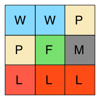
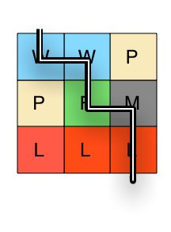

В данном задании нужно дополнить класс `GameBoard` (представление игрового поля настольной игры) двумя методами. Игровое поле - это квадратная доска с плитками разных типов местности: "вода" - Water, "равнина" - Plains, "лес" - Forest, "лава" - Lava, "горы" - Mountains.

Вот пример поля 3х3 с разными плитками:

```text
Water  Water  Plains
Plains Forest Mountains
Lava   Lava   Lava
```

В голове это можно представить как:



### Классы

#### `TerrainHelper`

Класс `TerrainHelper` уже написан. Он содержит вспомогательные функции, посмотрите на них.

Для того, чтобы описать, что делает этот класс, предоставлены тесты. Потратьте немного времени на то, чтобы просмотреть код и тесты один за другим. `TerrainHelper` будет полезен при выполнении задания.

#### `GameBoard`

Класс `GameBoard` уже существует, но его методы пока что пустые. Класс содержит следующие свойства:

- `terrainList` - список плиток (например, ["W", "P", "W"])
- `size` - размер доски
- `terrainHelper` - экземпляр класса `TerrainHelper`

## Релизы

## Релиз 0: Функция terrainMap у `GameBoard`

Посмотрите на тесты. Во время создания нового экземпляра `GameBoard`, он получает список заглавных букв плиток. Например: `["W","W","P","P","F","M","L","L","L"]`.
Функция `terrainMap` необходима, чтобы взять эти буквы, перевести их в символы плиток и составить из них доску размера `size` x `size`.
Это означает, что `["W","W","P","P","F","M","L","L","L"]` размера 3 превратится в:

```javascript
[
  ["water", "water", "plains"],
  ["plains", "forest", "mountains"],
  ["lava", "lava", "lava"]
];
```

**Не забудьте просмотреть существующий код и тесты перед погружением в задание**
Дополните класс `GameBoard` в `gameBoard.js` так, чтобы тесты нулевого релиза проходили.

_Не изменяйте тесты._

## Релиз 1: `GameBoard difficultyOfJourney`

В этом релизе нам нужно написать метод, который берет путь по доске и определяет, насколько сложным он будет. Релиз не такой сложный, как вам кажется - внимательнее изучите имеющиеся методы у `TerrainHelper`.
Сложностью пути будет являться сумма сложностей каждой пройденной плитки.
На вход метод принимает список координат, сделанный из `row` (строка) и `column` (столбец), например: `[[row, column], [row, column], [row, column]]`.
То есть, если метод получает такой список...

```javascript
[[0, 0], [0, 1], [1, 1], [1, 2], [2, 2]];
```

... то он должен вернуть, насколько сложным будет этот путь через поле:



Тесты изначально будут падать. Доработайте нужный метод класса `GameBoard` в `gameBoard.js` так, чтобы тесты проходили

_Не изменяйте тесты._
